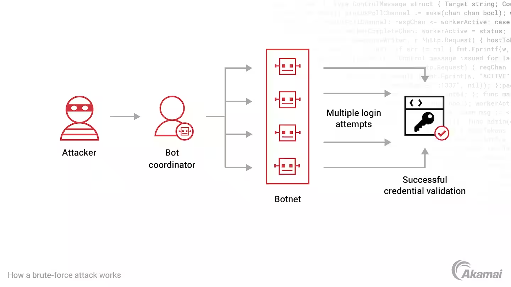
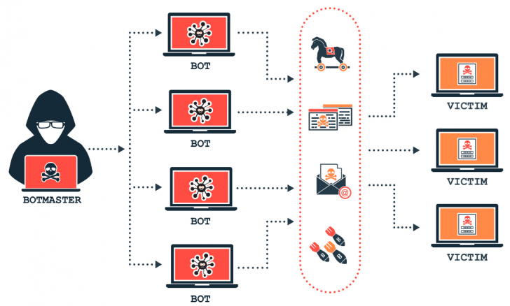
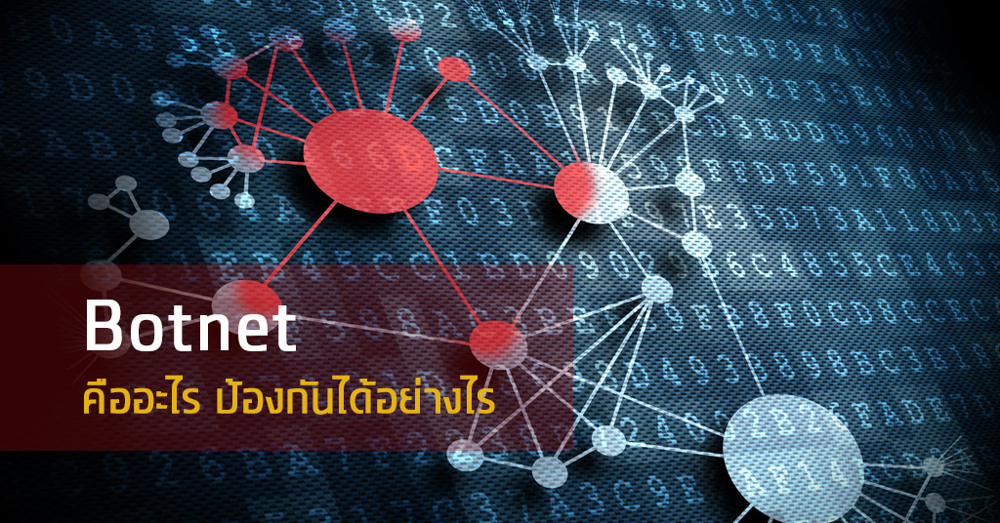

**Botnet**
- - -
**What is a Botnet?**

A botnet is a network of computers infected with malicious software (malware) and controlled by an attacker or cybercriminal. The computers in the botnet can be used to launch coordinated attacks such as account takeover, distributed denial-of-service (DDoS) attacks, and phishing campaigns, and to steal sensitive information. Botnets can be used for a variety of other malicious activities as well.

 

         
     

**The dangers of botnet traffic**
Botnets continue to be a preferred tool for cybercriminals as they seek to access accounts, steal data, commit fraud, and disrupt business. By infecting thousands or millions of malware-infected computers and internet-connected devices, hackers can take control of these machines and use them to launch DDoS campaigns, send spam messages, generate fake internet traffic, and enable many other criminal and malicious acts.

Account takeover attacks and credential stuffing are among the most dangerous uses of a botnet. Using stolen credentials purchased on the dark web, threat actors use botnets to inject username and password pairs into the login pages of a large number of websites, attempting hundreds of thousands of logins per hour. Because many individuals reuse passwords from site to site, these stolen credentials will often eventually enable attackers to gain unauthorized access to a user or business account. When credential stuffing attacks are successful, the loss of money, privacy, and trust for businesses and their customers can be devastating.

 

         
     

**แล้วเราจะป้องกัน Botnet ได้อย่างไร**

Reference 
> https://www.guru99.com/dbms-keys.html](https://www.akamai.com/glossary/what-is-a-botnet)https://www.akamai.com/glossary/what-is-a-botnet

- - -

**Botnet คืออะไร ?**

ภัยอันตรายบนโลกอินเทอร์เน็ตนั้นมีอยู่หลายรูปแบบ ไม่ว่าจะเป็นการขโมยข้อมูลจากเหยื่อ, การเรียกค่าไถ่ไฟล์ ไปจนถึงการโจมตีแบบ DDoS ถ้าหากระเบิดนิวเคลียร์เป็นหนึ่งในอาวุธสงครามที่ร้ายแรงเป็นอันดับต้น ๆ บนโลกความเป็นจริงแล้วล่ะก็ การโจมตีแบบ DDoS (DDoS Attack) ก็เฉกเช่นเดียวกัน  เวลาคุณเข้าเว็บไซต์ หรือเซิร์ฟเวอร์เกมไม่ได้ หากไม่ได้เป็นปัญหาที่ตัวระบบเอง ส่วนใหญ่แล้วก็มีเหตุผลมาจากการที่เซิร์ฟเวอร์ถูก DDoS

**บอทเน็ตคืออะไร ? (What is Botnet ?)**

Botnet เป็นคำที่เกิดขึ้นจากการสมาสระหว่างคำว่า "Robot" (หุ่นยนต์) กับ "Network" (เครือข่าย) เข้าด้วยกัน 

โดยมันหมายถึงเครือข่ายอุปกรณ์ที่ถูก แฮกเกอร์ (Hacker) เข้ามาจารกรรมฝัง มัลแวร์ (Malware) ที่สามารถสั่งการอุปกรณ์ของเหยื่อผ่านเครือข่าย อินเทอร์เน็ต (Internet) เอาไว้ อุปกรณ์ที่มีมัลแวร์ฝังไว้ทั้งหมดจะเรียกว่า "Bots"  ส่วนแฮกเกอร์ที่คอยควบคุมพวกมันอยู่เบื้องหลังจะเรียกว่า "Bot Herder" (ผู้เลี้ยงบอท) Bot ยังมีอีกชื่อเรียกคือ "Zombie" (ซอมบี้) ตัว Botnet ก็เลยเปรียบได้กับกองทัพซอมบี้นั่นเอง

 

         
     

แฮกเกอร์ผู้เป็น Bot Herder จะมีอำนาจควบคุมแบบรวมศูนย์ สามารถสั่งการ Botnet ทั้งหมดที่มีอยู่ได้จากที่เดียว ซึ่ง Botnet เหล่านี้จะถูกใช้สำหรับการโจมตีขนาดใหญ่ นอกจากนี้ แฮกเกอร์ยังสามารถอัปเดตตัว Botnet เพื่อปรับปรุงความสามารถของมันได้ด้วย

รูปแบบการโจมตีของ Botnet สามารถทำได้หลายอย่าง ไม่ว่าจะเป็นการโจมตีในสเกลขนาดใหญ่, ขโมยข้อมูล, ล่มเซิร์ฟเวอร์,สแปมอีเมล และทำ การโจมตีแบบ DDoS เป็นต้น

**ขั้นตอนการทำงานของ Botnet**
ตอนนี้น่าจะเข้าใจแล้วว่า Botnet คืออะไร ? ต่อไปมาทำความเข้าใจลำดับการทำงานของมันแบบพอสังเขป

1. เตรียมกองทัพ Botnet
ในขั้นตอนแรกแฮกเกอร์จะพยายามแพร่กระจายมัลแวร์ออกไปให้ได้มากที่สุด ส่วนใหญ่ก็จะนิยมใช้โทรจันในการแพร่เชื้อ มัลแวร์จะซ่อนตัวอยู่เงียบ ๆ จนกว่าจะมั่นใจว่ามีอุปกรณ์ที่ติดเชื้อ Botnet ในจำนวนที่มากพอแล้ว โดยมันอาจมีมากถึงหลักล้านเครื่องขึ้นไป แฮกเกอร์ถึงจะเริ่มใช้งานมัน 

2. เชื่อมต่อกองทัพเข้ากับเซิร์ฟเวอร์ของแฮกเกอร์
อุปกรณ์ทั้งหมดที่มีมัลแวร์แฝงตัวอยู่เป็นที่เรียบร้อยแล้ว จะเชื่อมต่อไปที่เซิร์ฟเวอร์กลางของแฮกเกอร์ เพื่อรอรับคำสั่ง

3. ลงมือโจมตี
อุปกรณ์ที่ตกอยู่ในการควบคุมเป็นที่เรียบร้อยแล้ว แฮกเกอร์จะมีอำนาจในระดับผู้ดูแลระบบ (Administrator) เขาสามารถเก็บเกี่ยวข้อมูลของผู้ใช้, อ่าน และเขียนทับข้อมูลในระบบ, แอบส่องพฤติกรรมการใช้งานของผู้ใช้, รวมกำลังพลกองทัพบอทเพื่อทำ DDoS attack, ส่งอีเมลสแปม, ขุดเหมือง Crypto Mining ฯลฯ

**แล้วเราจะป้องกัน Botnet ได้อย่างไร**

1. เปลี่ยนรหัสผ่านของอุปกรณ์ – อุปกรณ์ IoT ที่ใช้รหัสผ่านดั้งเดิมจากโรงงานมักถูกแฮกแล้วเปลี่ยนเป็น Botnet ได้ง่าย
2. อัปเดตซอฟต์แวร์สม่ำเสมอ – เพื่ออุดช่องโหว่ไม่ให้แฮกเกอร์ใช้โจมตีอุปกรณ์
3. ใช้ Firewall – Firewall ปัจจุบันช่วยตรวจจับทราฟฟิกไม่พึงประสงค์และป้องกันการโจมตีอุปกรณ์ในระบบเครือข่ายจากแฮกเกอร์
4. แยกวงอุปกรณ์ IoT ออกมา – แทนที่จะรวมอุปกรณ์ IoT ไว้ในเครือข่ายหลัก ให้สร้างเครือข่ายสำหรับอุปกรณ์ IoT โดยเฉพาะขึ้นมา และไม่มีการแชร์ข้อมูลข้ามเครือข่าย เมื่ออุปกรณ์ IoT ถูกโจมตี เครือข่ายหลักจะไม่ได้รับผลกระทบ
5. ควรระมัดระวังในการใช้งานอินเทอร์เน็ต – หลีกเลี่ยงการเข้าถึงเว็บโป๊หรือเว็บการพนัน ไม่กดโฆษณาที่ดูให้ผลตอบแทนเกินจริง รวมไปถึงติดตั้งโปรแกรม Antivirus และ Adblocker เพื่อป้องกันการลอบขุดเหรียญเงินดิจิทัล

 

         
     

อ้างอิง
> https://cst.tsu.ac.th/courseonline/course/computer_it/database/key.html](https://tips.thaiware.com/2421.html#what-is-botnet)https://tips.thaiware.com/2421.html#what-is-botnet

> https://www.cyfence.com/it-360/what-is-botnet/

- - -
