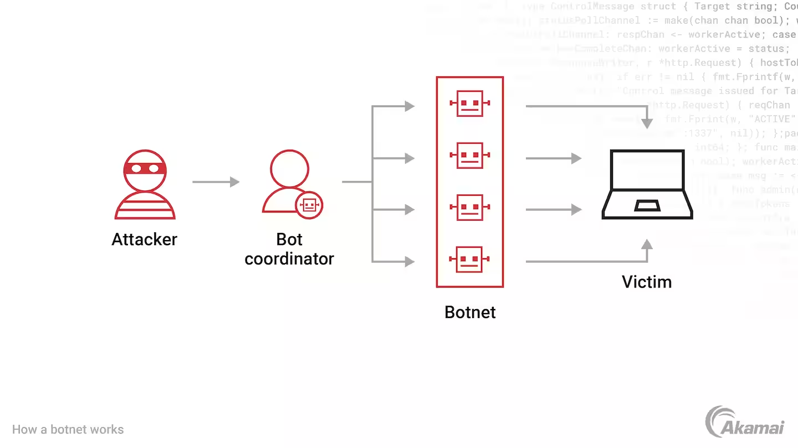

**Botnet**
- - -
**What is a Botnet?**

A botnet is a network of computers infected with malicious software (malware) and controlled by an attacker or cybercriminal. The computers in the botnet can be used to launch coordinated attacks such as account takeover, distributed denial-of-service (DDoS) attacks, and phishing campaigns, and to steal sensitive information. Botnets can be used for a variety of other malicious activities as well.

 

         
     

**The dangers of botnet traffic**
Botnets continue to be a preferred tool for cybercriminals as they seek to access accounts, steal data, commit fraud, and disrupt business. By infecting thousands or millions of malware-infected computers and internet-connected devices, hackers can take control of these machines and use them to launch DDoS campaigns, send spam messages, generate fake internet traffic, and enable many other criminal and malicious acts.

Account takeover attacks and credential stuffing are among the most dangerous uses of a botnet. Using stolen credentials purchased on the dark web, threat actors use botnets to inject username and password pairs into the login pages of a large number of websites, attempting hundreds of thousands of logins per hour. Because many individuals reuse passwords from site to site, these stolen credentials will often eventually enable attackers to gain unauthorized access to a user or business account. When credential stuffing attacks are successful, the loss of money, privacy, and trust for businesses and their customers can be devastating.

 

         
     

