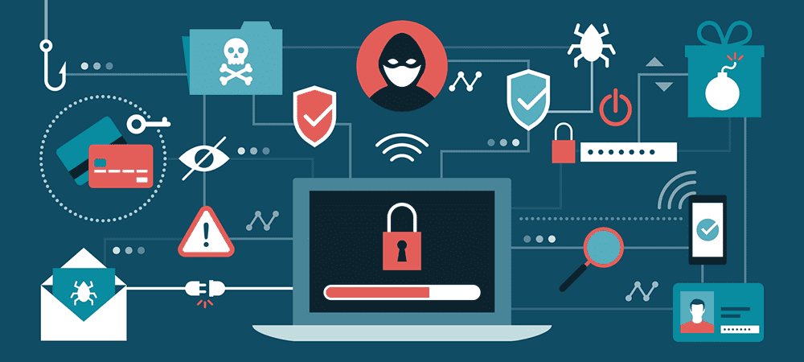
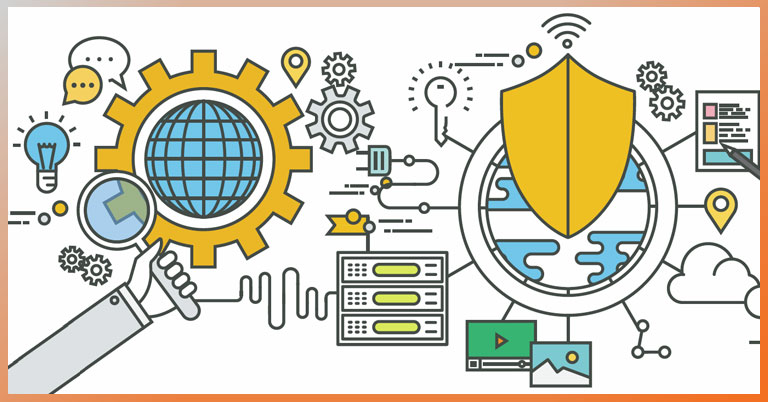

# Malware
- - -
**What is malware?**

Malware, short for malicious software, refers to any intrusive software developed by cybercriminals (often called hackers) to steal data and damage or destroy computers and computer systems. Examples of common malware include viruses, worms, Trojan viruses, spyware, adware, and ransomware. Recent malware attacks have exfiltrated data in mass amounts.

**What is the intent of malware?**

+ Malware is developed as harmful software that invades or corrupts your computer network. The goal of malware is to cause havoc and steal information or resources for monetary gain or sheer sabotage intent. 
+ Intelligence and intrusion
Exfiltrates data such as emails, plans, and especially sensitive information like passwords.
+ Disruption and extortion
Locks up networks and PCs, making them unusable. If it holds your computer hostage for financial gain, it's called ransomware.
+ Destruction or vandalism
Destroys computer systems to damage your network infrastructure.
+ Steal computer resources
Uses your computing power to run botnets, cryptomining programs (cryptojacking), or send spam emails.
+ Monetary gain
Sells your organization's intellectual property on the dark web.

  

         
     

Reference 
> https://www.guru99.com/dbms-keys.html

- - -

**มัลแวร์ คือ อะไร**

“มัลแวร์” หรือ “ไวรัสคอมพิวเตอร์” คืออะไร และจะส่งผลกระทบอะไรต่อคอมพิวเตอร์ของเรา
MALWARE (มัลแวร์)  นั้นย่อมาจาก MALicious และ SoftWARE หมายถึง โปรแกรมประสงค์ร้ายที่ถูกเขียนขึ้นมา เพื่อทำอันตรายกับข้อมูลในระบบ เช่น ทำให้เครื่องคอมพิวเตอร์ทำงานผิดปกติ ขโมยหรือทำลายข้อมูลหรืออาจจะเปิดช่องทางให้ผู้ไม่หวังดีเข้ามาควบคุมเครื่องของเราได้

ประเภทของมัลแวร์ เช่น
+ Virus (ไวรัส) สามารถแพร่กระจายตัวเองไปยังเครื่องอื่น ๆ ผ่านไฟล์ที่ส่งต่อกันระหว่างเครื่อง เมื่อมันแอบเข้ามายังคอมพิวเตอร์ได้แล้ว มันก็จะเข้าไปก่อกวนการทำงานจนทำให้เกิดผลเสียต่อเครื่องคอมพิวเตอร์ เหมือนเวลาที่เราป่วยเพราะไวรัส ร่างกายของเราก็จะทำงานได้ไม่เต็มที่เท่าเดิม คอมพิวเตอร์เองก็เช่นเดียวกัน
+ Worm (เวิร์ม) สามารถแพร่กระจายตัวเองไปยังเครื่องอื่น ๆ ผ่านเครือข่ายคอมพิวเตอร์ได้เองโดยอัตโนมัติ คล้ายกับตัวหนอนที่ชอนไชไปยังเส้นทางต่าง ๆ จนทำให้เครือข่ายล่มหรือใช้งานไม่ได้
+ Trojan (โทรจัน) ถูกสร้างขึ้นมาเพื่อหลอกเราว่า มันเป็นโปรแกรมทั่วไปที่ไม่มีพิษภัย แล้วให้ผู้ใช้หลงเชื่อและนำไปติดตั้ง หลังจากนั้น มันก็จะสามารถเข้าไปเล่นงานระบบของเราได้ง่าย ๆ
+ Backdoor (แบ็กดอร์) มีความสามารถในการเปิดช่องทางให้ผู้ไม่หวังดีสามารถเข้ามาควบคุมเครื่องคอมพิวเตอร์ของเราได้และ สามารถทำอะไรก็ได้กับเครื่องของเรา เช่น สั่งลบหรือโอนย้ายข้อมูลของเราก็ได้
+ Spyware (สปายแวร์) คอยแอบดูพฤติกรรมการใช้คอมพิวเตอร์ของเรา และยังสามารถขโมยข้อมูลส่วนตัวของเราไปได้ด้วย ซึ่งถือเป็นเรื่องที่อันตรายมาก ๆ

**10 วิธีป้องกัน Ransomware ก่อนมันมาถึงตัว**

  

         
     

1. วางแผนแบ็กอัพไฟล์
วางแผนและพัฒนาระบบแบ็กอัพและกู้คืนข้อมูลให้ต่อเนื่องและมีประสิทธิภาพ และเก็บข้อมูลแบบออฟไลน์เอาไว้บนอุปกรณ์แยกอีกต่างหาก

2. ใช้ทูลที่มีประสิทธิภาพ
ใช้เครื่องมือรักษาความปลอดภับเว็บและอีเมล์ที่สามารถวิเคราะห์เมล์, เว็บ และไฟล์ที่แฝงไปด้วยมัลแวร์ ตลอดจนบล็อกโฆษณาที่อาจจะแฝงภัยร้ายมาได้ ซึ่งเครื่องมือเหล่านี้รวมไปถึงพวก Sandbox ที่สามารถวิเคราะห์ภัยคุกคามพร้อมสร้างสภาพแวดล้อมให้ปลอดภัยได้

3. อัพเดตแพทช์ในอุปกรณ์
พยายามที่จะอัพเดตหรือแพทช์ความปลอดภัยต่างๆ อย่างต่อเนื่อง ไม่ว่าจะเป็น โอเอส, อุปกรณ์, ซอฟต์แวร์ ฯลฯ

4. อัพเดตซอฟต์แวร์ความปลอดภัย
ตรจสอบว่าพวกแอนตี้ไวรัสทั้งบนอุปกรณ์และเครือข่ายต่างๆ นั้นอัพเดตล่าสุดตลอดเวลา

5. ใช้แอพพลิเคชันที่ปลอดภัย
ถ้าเป็นไปได้ให้ใช้แอพพลิเคชันในลิสต์ที่มีความปลอดภัย และป้องกันแอพพลิเคชันที่ไม่ได้รับการรับรองการทำงาน (จากการดาวน์โหลด)

6. แบ่งเครือข่ายออกเป็นโซน
แบ่งเครือข่ายความปลอดภัยออกเป็นโซนๆ ซึ่งหากโซนใดโซนหนึ่งเกิดติดภัยร้าย มันก็จะไม่ลามไปยังส่วนอื่นอย่างง่าย (ซึ่งเราก็สามารถแก้ปัญหาเป็นส่วนๆ ได้)

7. กำหนดสิทธิ์และบังคับใช้
ทำการสร้างและบังคับใช้สิทธิ์ในการทำงาน โดยให้ระมัดระวังไม่ให้ยูสเซอร์จำนวนต่างๆ ไปมีผลกระทบหรือติดเชื่้อลามไปยังพวกแอพพลิเคชันด้านธุรกิจ,ข้อมูล หรือเซอร์วิสต่างๆ ขององค์กร

8. จัดการเรื่อง BYOD
กำหนดนโยบายความปลอดภัยในส่วนของ BYOD ให้ชัดเจน จะช่วยทำให้คุณสามารถตรวจสอบและทำการบล็อกอุปกรณ์ ซึ่งอาจจะไม่ผ่านมาตรฐานด้านซีเคียวริตี้ขององค์กร (เช่น อาจจะไม่มีติดตั้งซอฟต์แวร์ป้องกันมัลแวร์, แอนตี้ไวรัสไม่อัพเดต, ระบบปฏิบัติการไม่ได้อุดแพทช์ และอื่นๆ เป็นต้น)

9. ใช้งานพวกเครื่องมือวิเคราะห์ภัยร้าย
ใช้เครื่องมือในการวิเคราะห์ภัยร้ายในแบบเชิงลึก เพื่อตรวจสอบการติดเชื้อภัยคุกคาม ไม่ว่าจะเป็น
 1) ในจุดที่ภัยเข้ามา
 2) ระยะเวลาที่ติดเชื่อในองค์กรของคุณว่านานเท่าใด
 3) การลบพวกมันออกจากดีไวซ์ต่างๆ และ
 4) วิธีการที่จะให้คุณแน่ใจว่ามันจะไม่กลับมาอีก

10. อบรมพนักงาน
ให้ความรู้แก่พนักงาน ให้พวกเขาได้เรียนรู้ถึงเรื่องความปลอดภัย และพยายามอย่าคลิกไฟล์ที่แปลกประหลาด, หรือไฟล์ที่แนบมากับอีเมล์ที่ไม่คุ้นเคย หรือไม่เข้าไปตามเว็บที่ส่งมาทางอีเมล์ ซึ่งต้องบอกว่ามนุษย์นี้แหล่ะคือต้นตอแห่งช่องโหว่ต่างๆ ที่เกิดขึ้น

Reference 
> [https://www.guru99.com/dbms-keys.html](https://www.etda.or.th/th/Useful-Resource/What-Is-Malware.aspx)https://www.etda.or.th/th/Useful-Resource/What-Is-Malware.aspx

> https://www.cyfence.com/article/3-ways-protect-from-ransomware/

- - -
