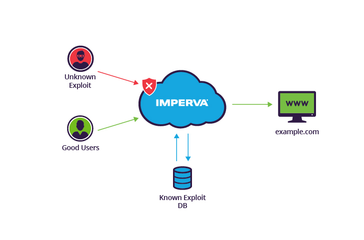
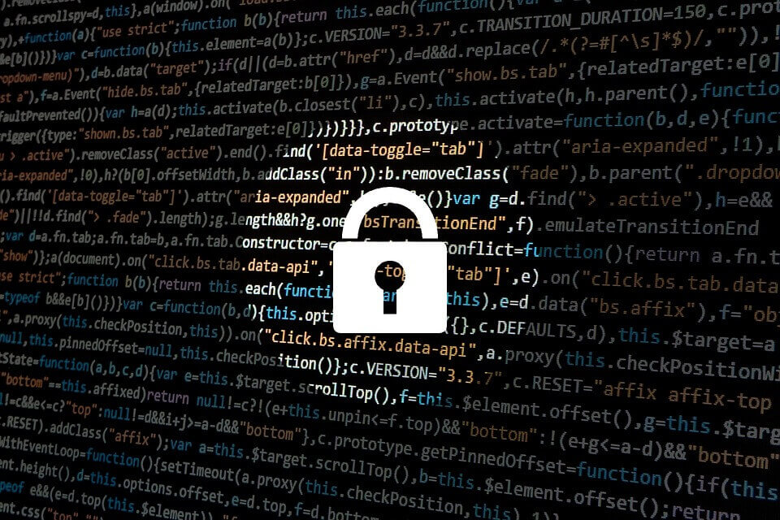

# Zero Day Attack
- - -

         
     

     
**What is Zero Day Attack?**

  There are many types of security vulnerabilities and opportunities for cyberattacks. Businesses are responsible for keeping their organizations protected against these attacks, both to adhere to regulatory compliance and to keep their employees, customers, and proprietary data safe. One of the most common and most difficult flaws to protect against is a zero day vulnerability, but what is a zero day vulnerability, and how can it be exploited?

**What is a Software Vulnerability?**

  Software programs often have vulnerabilities. These are unintentional flaws, or holes in software programs that could hypothetically be taken advantage of. For example, there may be a flaw that allows a cybercriminal to gain access to otherwise secure data.

  Software programmers are often on the lookout for these vulnerabilities. When they discover a vulnerability, they analyze it, come up with a “patch” to fix the vulnerability, then issue that patch in a new release of the software.

  However, this is a process that takes time. When the flaw becomes known, hackers all over the world can begin attempting to exploit it; in other words, developers have zero days to find a fix for the problem, hence the term “zero day vulnerability”.

**Zero Day Attacks**
  If a hacker manages to exploit the vulnerability before software developers can find a fix, that exploit becomes known as a zero day attack.

  Zero day vulnerabilities can take almost any form, because they can manifest as any type of broader software vulnerability. For example, they could take the form of missing data encryption, SQL injection, buffer overflows, missing authorizations, broken algorithms, URL redirects, bugs, or problems with password security.

  This makes zero day vulnerabilities difficult to proactively find—which in some ways is good news, because it also means hackers will have a hard time finding them. But it also means it’s difficult to guard against these vulnerabilities effectively.

**How to Protect Against Zero Day Attacks**

  It’s difficult to protect yourself from the possibility of a zero day attack, since they can take many forms. Almost any type of security vulnerability could be exploited as a zero day if a patch is not produced in time. Additionally, many software developers intentionally try not to publicly reveal the vulnerability, the hopes that they can issue a patch before any hackers discover that the vulnerability is present.

Reference 
> https://www.checkpoint.com/cyber-hub/threat-prevention/what-is-zero-day-attack/

- - -

**Zero-Day Attack คืออะไร ?**

   Zero day (ซีโร่ เดย์) คือช่องโหว่ของSoftware (ซอฟต์แวร์)ที่ผู้พัฒนาซอฟแวร์ยังไม่ค้นพบ แต่คนที่ค้นพบช่องโหว่ก่อน คือ แฮกเกอร์ ซึ่งจะสร้างความเดือนร้อนให้กับผู้พัฒนาซอฟแวร์และผู้ใช้งานซอฟแวร์ทั่วไปนั่นเดือดร้อนเป็นอย่างมาก 
   เทรนด์ ไมโคร (Trend Micro) ได้กล่าวว่า "การใช้ประโชน์จากช่องโหว่เป็นอัตราย ไม่ใช่แค่เพราะผลกระทบที่เกิดขึ้น แต่รวมถึงความง่ายในการโจมตีแต่ละครั้งที่เกิดขึ้นด้วย โดยครอบคลุมไปถึงการใช้เทคนิคการจัดการทางสังคมที่ประสบความสำเร็จไปแล้วหลายต่อหลายครั้ง การโจมตีโดยใช้จุดอ่อนในลักษณะนี้ ไม่จำเป็นต้องใช้การปฏิสัมพันธ์จากผู้ใช้ นอกเหนือไปจากการหลอกให้ผู้ใช้เข้าไปในเว็บไซต์ปลอม ซึ่งเป็นวิธีการโกงของPhishing (ฟิชชิ่ง)  แบบเก่าที่ใช้แล้วประสบความสำเร็จเสมอ"

         
     

   การโจมตีแบบใหม่ๆที่ยังไม่มีการป้องกัน หรือ Zero day attack นั้น เกิดขึ้นอยู่ตลอดเวลา เพราะทางฝั่งแฮกเกอร์เองก็จะคอยหาช่องทางใหม่ๆหรือวิธีการใหม่ๆ เพื่อให้การโจมตีนั้นได้ผลตามต้องการ โดยมาในรูปแบบที่หลากหลาย ทั้งVirus , Malware , Ransomeware , หรือแม้กระทั่ง Phishing  
   ความร้ายแรงของช่องโหว่แบบ Zero day คือผู้ใช้ไม่มีหนทางที่สามารถป้องกันตัวอย่างสิ้นเชิง เนื่องจากไม่มีใครอื่นนอกจากHackerเท่านั้นที่รู้ว่า ช่องโหว่อยู่ตรงไหน ในหลายกรณีผู้ใช้แทบไม่รู้ตัวด้วยซ้ำว่าเครื่องคอมพิวเตอร์ของตนเองโดนโจมตี

**วิธีป้องกันตัวจาก การโจมตีแบบ Zero-day**

วิธีป้องกันตัวจาก การโจมตีแบบ Zero-day เพื่อให้ข้อมูลส่วนตัว หรือข้อมูลที่สำคัญในคอมพิวเตอร์ของเราได้รับการปกป้องไม่ให้ถูกโจมตี
+ หมั่นอัปเดตซอฟต์แวร์ และระบบปฏิบัติการเป็นประจำ : เวลาผู้พัฒนาปล่อยอัปเดตออกมา มักจะไม่ได้มีแค่การเพิ่มคุณสมบัติ หรือแก้ไขข้อผิดพลาดเท่านั้นนะ แต่จะมีการอุดช่องโหว่ด้านความปลอดภัยให้ด้วย
+ ติดตั้งโปรแกรมเท่าที่จำเป็น : คำว่ายิ่งเลอะ ยิ่งเยอะประสบการณ์ ไม่เหมาะกับคอมพิวเตอร์สักเท่าไหร่ เพราะโปรแกรมยิ่งเยอะ โอกาสที่เราจะเผชิญกับช่องโหว่ก็เยอะตามไปด้วย พยายามติดตั้งโปรแกรมเท่าที่จำเป็นต้องใช้งาน โปรแกรมอะไรที่ไม่ได้ใช้ก็ลบทิ้งไป
+ เปิดระบบ Firewall : Firewall เป็นเทคโนโลยีสำคัญที่ช่วยป้องกันการโจมตีผ่านระบบเครือข่ายได้เป็นอย่างดี แม้บางครั้งมันอาจจะสร้างความหงุดหงิดให้กับกิจกรรมออนไลน์บางอย่างบ้าง แต่เปิดไว้ปลอดภัยกว่าแน่นอน
+ อบรมให้ความรู้ : ในส่วนของ การโจมตีแบบ Zero-day ส่วนใหญ่ที่โจมตีสำเร็จ เหตุผลมาจากความไม่รู้ที่ก่อให้เกิดปัญหา (Human Error) บริษัทจึงควรมีการอบรมให้ความรู้ด้านเทคโนโลยีให้แก่พนักงานภายในองค์กรด้วย
+ ใช้ซอฟต์แวร์ป้องกันมัลแวร์ : หากรู้สึกว่าระบบป้องกันมัลแวร์ที่มีมากับระบบปฏิบัติการ Windows ไม่อุ่นใจพอ งานที่ทำต้องการความปลอดภัยสูงเป็นพิเศษ ก็อาจมองหา โปรแกรมแอนตี้ไวรัส (Antivirus Software) ดีๆ สักตัวมาใช้งาน

   อ้างอิง 
> https://www.mindphp.com/บทความ/4953-รู้จักกับ-zero-day-attack-ซีโร่-เดย์-แอคแทค.html

> https://tips.thaiware.com/1752.html

- - -
